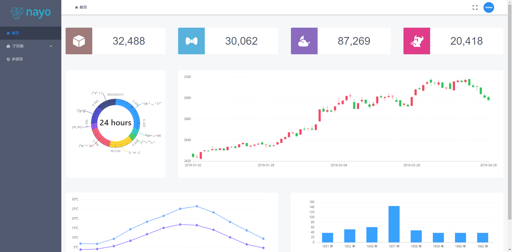

### nayo-demo-layout

---
1. 截图

2. 使用方法

①在simple模板中的/src/layout中放入该文件夹，然后在layout的出口文件中，暴露该组件

②在main.js中，引入layout，然后注册全局组件，例如Vue.component("layout", a)

③在App.vue中，<nayo-admin layout="layout"></nayo-admin>放入布局组件

④完成

3. 作者

Terence.Sun  terence@segofun.com

4. 补充

这个layout只是个demo，你可以改造这个demo，你可以做得比我好很多~~

如果还有不明白的，请前往[nayo admin demo](https://github.com/nayo-project/nayo-admin)了解layout怎么使用